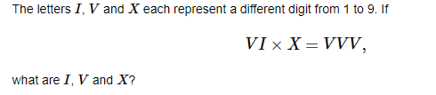

```{r setup, include=FALSE}
knitr::opts_chunk$set(echo = TRUE)
```

## Introduction

This article contains some challenging problems. Solving these problems, require innovative and out-of-the-box thinking.


## First problem: 

Two points along a drinking straw are picked at random. The straw is then bent at these points. What is the probability that the two ends meet up to make a triangle?

#### Comment 1

The probability is 0.75
verify in R: runif(1000) -> x; runif(1000) -> y; mean(abs(x-y) < 0.5)
and I have a strong proof for that answer

#### Comment 2:
I asked this question to the groom at the wedding on Friday while we were standing in the church waiting for the bride. He was not able to do it

### Solution:

The length of the middle section must be less than sum of lengths of the side sections.  \n
Re-state the problem:  \n
two random real numbers are picked from uniform distribution between 0 and 1.  \n
Find the probability that |x-y| <= 0.5  \n
Re-state the descritized problem, assuming n = 10:  \n
two integer numbers are randomly picked between 1 and 10. What is the probability that |x-y| <= 5 ?  \n
 
All possible variations = 10^2 = 100
 
acceptable variations:  

if x = 1:   y = {1,2,3,4,5,6}            (6 variations)  

if x = 2:   y = {1,2,3,4,5,6,7}          (7 variations)   
...

if x = 5:   y = {1,2,3,4,5,6,7,8,9,10}   {10 variations} 

if x = 6:   y = {1,2,3,4,5,6,7,8,9,10}   {10 variations} 

if x = 7:   y = {2,3,4,5,6,7,8,9,10}     {9 variations} 

...

if x = 10:  y = {5,6,7,8,9,10}           {6 variations} 

 
total number of acceptable variations: 2*(6 + 7 + 8 + 9 + 10)
 
extending it to n, it will be: 2*[(1+2+...+n) - (1 + 2 + ... + n/2)] = n*(1 + n) - (n/2)*(1 + n/2) = 3*n^2/4 + n/2  

and probability becomes:
 
  3*n^2/4 + n/2  
  
----------------- = 3/4 + 1/(2n)  

       n^2
       
This approaches 0.75 when n goes to infinity       


#### Comment 

In the first problem, The answer 1/4 assumes one additional constraint, and that the two ends of the straw should meet at the vertex. 

## Second Problem:

There are 27 cars among which you need to find out the fastest 3 cars. You can conduct race among at most 6 cars to rank their speed.
At no point you can find out the actual speed of the car in a race.
Find out how many races are required to get the top 3 cars.

### Solution:

a1 a2 a3 a4 a5 a6 

b1 b2 b3 b4 b5 b6 

c1 c2 c3 c4 c5 c6 

d1 d2 d3 d4 d5 d6 

e f g
 
run a/b/c/d, note the top 3 of each (4)
 
run winners and e/f. 

if e/f place its trivial
 
say a1/b1/c1 come 1/2/3, run 2nd and 3rd from a, 2nd from b and c1 with g.
 
a, and top 2 from race 6 are your fastest 3

### IVX Problem:



#### Comment 1

37*9=333

#### Comment 2

```{python eval=FALSE, echo = TRUE}
import itertools
options = list(range(1, 10))
for v, i, x in itertools.combinations(options, 3):
    if int(f"{v}{i}") * x == int(f"{v}" * 3):
        print(v, i, x)
```


## The donkey problem:

A donkey is attached by a rope to a point on the perimeter of a circular field. How long should the rope be so that the donkey can eat exactly half the grass in the field?

### Solution

You can assume r = 1, then any value you find for c, becomes ratio of r. This makes life a bit easier!


#### Comment:

Always there is a simpler way, that's a rule:)-

#### Comment:
Yes, find area by monte-carlo simulation and change c until it reaches half the area

## The chocholate problem:


### Comment

Jon Stevens Incomplete snaps. 2 breaks of 4/5 pieces lengthwise, then do four vertical breaks, creating three new pieces each time, then two more breaks to create the last 3 pieces.

### Comment

Incomplete snaps is clever, I think that will do it


Look at this: [Millennium Problems](https://www.claymath.org/millennium-problems)

## The elephant problem

Not a problem just thought this paper might appeal to this page:
https://fermatslibrary.com/s/drawing-an-elephant-with-four-complex-parameters#email-newsletter

It took 14 months for this paper to be accepted. I wonder what the reviewer feedback was

**pls make elephant cuter**

Probably no one wanted to be the approver!

http://www.openculture.com/2015/04/shortest-known-paper-in-a-serious-math-journal.html

## The chessboard Problem


### Solution:

No solution exists


## The wine bottle problem:

There are 8 bottles of wine, only one of them has poison and you have a number of rats for testing. What's the minimum number of rats you need to find the poisoned bottle in time T, and how? (You get the rats you need all at once, feed them all at the same time, and poison kills them after time T)

### Solution:

3 rats

Each rat has one bit. Represent each bottle as a binary. Let each rat drnik whose rat number bit is set. 

Rat1-Rat2-Rat3

more understandable if you draw a Venn Diagram of three sets

its the only thing I remember in school
I was more interested in the rat dying and how would I get out of this problem than the actual math bit

## The 36 bottles problem

Now, let's make it a bit more challenging. We have 36 bottles (one of them poisoned). Assume it takes 10 min for the poison to kill a rat and you have 20 minutes time to find the poisoned bottle. What is the minimum number of rats you need to find the poisoned bottle. (You get all the rats you need once)


## The rectangle side problem:


### Solution

1.5 (too easy)

## The three squares problem:


### Solution:

8 times the area of the blue square: 14*8

## The cord problem:


### Solution:

8?

R^2 - r^2 = 16 if R is the radius of the big circle and r the small circle

so pi*(R^2 - r^2) = 16*pi is the difference of areas of the whole circles. 8*pi is half of that. So answer should be 8.


## The birthday problem:

There are 20 random people in a room. What is the probability that at least two of them have the same birthday?

### Solution:

1- [(1/365)^20 * (365!/345!)] ~= 0.41

#### Comments:

I think the answer is wrong because it doesn't account for 29th of February!
1- [(1/366)^20 * (366!/346!)]
This is the right answer, I take full credit and had no help from anyone else's previous solutions

Oh but of course, 29th of feb doesn't have the same probability as all the other days of the year. So it's more complicated

I thought of 29th of Feb, but that makes the problem very complicated
Since it happens once in four year, that particular day has a lower weight than other days.

Or if you want to be more picky, it happens once every 4 years, unless that year is (divisible by 100 and not divisible by 400)


## The playing cards problem:

There are four playing cards, at least one of which is face up. You never get to the see the cards, but can flip them one at a time. Your goal is to flip cards until they are all face down, at which point the game ends. What is the minimum number of flips to guarantee that all cards are face down from any starting arrangement, and what is an algorithm that will perform these flips?


## The marbles problem:


### Solution:

m/(m+n)*(m+k)/(m+k+n) + n/(m+n)*m/(m+n+k)
 
Blue then blue + yellow then blue

## The power derivative problem:


### Solution:

dy/dx = y^2/(x-x.yln(x))

dy/dx = y.(x^(y - 1))/(1 - log(x).(x^y))

and the two answers are identical considering y = x^y


## The series problem:

What is the sum of series: Sigma {n = 1 to Infinity} {n^2/2^n}:     1^2/2^1 + 2^2/2^2 + 3^2/2^3 + 4^2/2^4 + ... 

### Solution:


## The daily coding problem:

You are given an array S of n integers, and another integer x. Find an algorithm that determines whether there exists two elements in S that have a difference of x, and does so in O(nlog(n)) or, for bonus points, in O(n) time

### Solution:

Make an empty dict/hash table

for each item S[i]:

is S[i] - x or S[i] + x in the dict/hash table?

if yes win

if no add S[i] to the hash table

I have the answer to this one, I did it a few weeks ago. 
Got it from [here](https://www.dailycodingproblem.com)

## The hospital problem:

An easy question: 
A certain town is served by two hospitals. In the larger hospital about 45 babies are born each day, and in the smaller hospital about 15 babies are born each day. As you know, about 50% of all babies are boys. However, the exact percentage varies from day to day. Sometimes it may be higher than 50%, sometimes lower.


For a period of 1 year, each hospital recorded the days on which more than 60% of the babies born were boys. Which hospital do you think recorded more such days?

* The larger hospital
* The smaller hospital
* About the same


This question was asked by Daniel Kahneman, I think in about 50 years ago

### Solution:

Option 2


## The average IO problem

The average IQ of the grade 8 students of a city is 100. We randomly pick 50 people from the 8 grades. Again we pick randomly one person for those 50 and his IQ is 150. What is the average IQ of the sample?

Daniel Kahneman asked this question in a conference full of statisticians.

### Solution:

In fact that's exactly Bayes theorem in a nice language. If you believe in Bayes the right answer is 101. Interestingly many of the statisticians at the time told 100 which is wrong

## Comments

So the average IQ of the sample is either 100, or is (150+(100*49))/50
 like 1

Because if you slowly started adding more IQs for each student, at some point you must adjust the mean yes?

but they're picked randomly so there should be no correlation between the 150 you picked and the other 49
yeah that extrapolation clarifies it aey toby, if you knew 49 of them had IQ of 150 what is the mean? can't say its still 100. At which point it needs to be linear


150 is a one-sample estimate of mean of the first sample.
I think it has something with posterior distribution: ~N(100, sigma) is the posterior distribution of the sample and now we have one observation of 150

## The Heather's problem:

Another Kahneman style question:

Heather is Canadian, kind, friendly, smart, and loves animals. She is a sustainability consultant. In college, she studied maths and psychology. She likes going for long walks and lives near several hiking trails. 
 
Which is more probably about Heather?
 
A) She has a PhD
B) She has a PhD and owns a dog 

#### Comments:

gut reaction says less specific = more likely, but I think conditionally knowing all the things it is more likely to be B

Surely B can only ever be less likely than A given that it is simply an extra condition. So I'd say A

### Solution:

"X" is always more likely than "X and Y", unless Y is a subset of X

When you ask the average person, most of them say B. But actually if you think a little, the answer is obviously A. People are naturally bad at probabilities.

## The call center problem:

Alice works in the call centre and she receives 6 calls hourly in average. At a point in time, the latest call received was 3 minutes ago. What is the probability that she will receive a call in the next 3 minutes?

and what is the answer if the latest call was received 5 minutes ago?

Hint: If calls are distributed uniformly throughout time, the inter-arrival times will have exponential distribution!

### Comments:

Will need to refer to queuing theory to anwer that

## The second series problem

What is the final result?


### Solution:

Answer is: -ln(0.5)

1/(1-x) = 1 + x + x^2 + x^3 + ...

This equation holds for all x with an absolute value between 0 and 1

integrate both sides and replace x with 0.5


and here is [another solution](https://www.wolframalpha.com/input/?i=sum+1%2F%28i*2%5Ei%29%2C+i%3D1+to+infinity).

## The complex problem:


## The jailers problem:

You and your friend are imprisoned. Your jailer offers a challenge. If you complete the challenge you are both free to go. The rules are:

 
The jailer will take you into a private cell. In the cell will be a chessboard and a jar containing 64 coins. The jailer will take the coins, one-by-one, and place a coin on each square on the board. He will place the coins randomly on the board. Some coins will be heads, and some tails (or maybe they will be all heads, or all tails; you have no idea. It's all at the jailers whim. He may elect to look and choose to make a pattern himself, he may toss them placing them the way they land, he might look at them as he places them, he might not …). If you attempt to interfere with the placing of the coins, it is instant death for you. If you attempt to coerce, suggest, or persuade the jailer in any way, instant death. All you can do it watch. Once all the coins have been laid out, the jailer will point to one of the squares on the board and say: “This one!” He is indicating the magic square. This square is the key to your freedom. The jailer will then allow you to turn over one coin on the board. Just one. A single coin, but it can be any coin, you have full choice. If the coin you select is a head, it will flip to a tail. If it is a tail it will flip to a head. This is the only change you are allowed to make to the jailers initial layout. You will then be lead out of the room. If you attempt to leave other messages behind, or clues for your friend … yes, you guessed it, instant death! The jailer will then bring your friend into the room. Your friend will look at the board (no touching allowed), then examine the board of coins and decide which location he thinks is the magic square. He gets one chance only (no feedback). Based on the configuration of the coins he will point to one square and say: “This one!” If he guesses correctly, you are both pardoned, and instantly set free. If he guesses incorrectly, you are both executed. The jailer explains all these rules, to both you and your friend, beforehand and then gives you time to confer with each other to devise a strategy for which coin to flip.

## The Monty-Hall problem:

Here has been quit for a long time. Let's have a conceptual question:
There are three wrapped boxes. Only one of them has a gold coin in it and the other two are empty. You choose one randomly. Before opening the box you have chosen, a second person who knows which box has the gold, opens one of the left two boxes and shows you that it is empty and asks you if you want to swap your chosen box with the other one. Which of the following is right:
1- You should change your box as that increases your chance of winning the gold coin.
2- Keeping your first chosen box gives you more chance of winning the gold.
3- The chance of winning the gold is the same whether you change your box or not.

## The prisoners problem:

There are 100 prisoners in solitary cells. There's a central living room with one light bulb; this bulb is initially off. No prisoner can see the light bulb from his or her own cell. Everyday, the warden picks a prisoner equally at random, and that prisoner visits the living room. While there, the prisoner can toggle the bulb if he or she wishes. Also, the prisoner has the option of asserting that all 100 prisoners have been to the living room by now. If this assertion is false, all 100 prisoners are shot. However, if it is indeed true, all prisoners are set free, since the world could always use more smart people. Thus, the assertion should only be made if the prisoner is 100% certain of its validity. The prisoners are allowed to get together one night in the courtyard, to discuss a plan. What plan should they agree on, so that eventually, someone will make a correct assertion?

### Comments:

Is the solution way easier than we made it?: Break up the calendar into 100 day chunks again. The first person to go in turns on the light. Then the next person keeps it on etc. until someone goes in twice. The first person to go in twice in the 100 day chunk turns if off, and it stays off until the next 100 day chunk
This just came to me 
If you get to the end and no-one has gone in twice, then you know everyone has gone in exactly once
Application of the pidgeonhole principle!

Still takes an astoundingly long time, but yes, it removes the need for choosing 100 things in the right order
still 1/10000 every 100 days

still about 1,500 years to have a 50% chance of getting out

There is better solution which gives little chance (about 20%) that the prisoners can be free within their lifetime!
Of course, if they are young enough, they can see freedom. The probability that they all get free in 40 years time is almost 1

## The factoriel problem:

How many zeroes are there at the end of the number 100!

```{python echo = T}
import math
math.factorial(100)
```

## The three digit number problem:

Take a three digit number where all the digits are the same (eg. 888).
Divide this number by the sum of its digits (eg. 888÷24).
Your answer is 37.
Prove that the answer will always be 37.

### Solution:

(100x + 10x + x)/3x = 111/3 = 37

## The ants problem:

100 ants (zero-length points) walk on a meter stick (a line) at 1 cm/second. When two ants collide, they both reverse direction. If an ant reaches the end of the stick, it falls off. What arrangement of ants maximizes the time before all ants have fallen off? How long can they last?

### Solution:

I will now explain the solution: two ants hitting each other and bouncing off is equivalent to two ants phasing through each other. So the best you can do in keeping at least one ant on the line is to start the ant on one end and march it over to the other end.

## The pirates problem:

Yragle the pirate has 100 white pearls and 100 black pearls. The white pearls are worthless, the black pearls are priceless. He will let you distribute the pearls between two sacks, labeled "Heads" and "Tails." After you distribute the pearls, you flip a fair coin and choose a pearl at random from the corresponding sack. How should you distribute the pearls between the two sacks to maximize your odds of getting a black pearl?

### Comments

put all the black pearls in one sack and the white in the other... Then you have a 50 50 chance... anything else would be a lower chance

There is a better solution

If you only have black pearls in one bag then it is guaranteed. So a solution where you place 1 black pearl in one bag, an 99 in the other gives you the best chance as it is 0.5(1) + 0.5(99/199) = 0.748

## The pigeionhole principle problem:

There are 100 people in a room. Each person knows some number of other people in the room; you cannot know yourself. Prove that there are at least 2 people who know the same number of people as each other.

### Comments;

The principle of the hole of a pig from Eion? That's a theorem I can get behind ( ͡° ͜ʖ ͡°)

## The graduation problem:

N people attend a graduation. At the end, they all throw their hats in the air, and they fall down randomly back on to people's heads such that each person ends up with 1 hat. What is the expected number of students who will end up with their original hat?

## The dice problem:

I roll two six-sided dice. At least one of them turns out to be a six. What is the probability that they are both sixes?

### Solution:

1/11

p(A|B) = P(A AND B)/P(B)

A: d1 = 6 AND d2 = 6, B: d1 = 6 OR d2 = 6
so it is (1/36)/(1/6 + 1/6 - 1/36) = 1/11

## The island problem:

A group of people with assorted eye colors live on an island. They are all perfect logicians—if a conclusion can be logically deduced, they will do so instantly. No one knows the color of their own eyes. Every night at midnight, a ferry stops at the island. Any islanders who have figured out the color of their own eyes then leave the island, and the rest stay. Everyone can see everyone else at all times and keeps a count of the number of people they see with each eye color (excluding themselves), but they cannot otherwise communicate. Everyone on the island knows all the rules in this paragraph.

On this island there are 100 blue-eyed people, 100 brown-eyed people, and the Guru (she happens to have green eyes). So any given blue-eyed person can see 100 people with brown eyes and 99 people with blue eyes (and one with green), but that does not tell him his own eye color; as far as he knows the totals could be 101 brown and 99 blue. Or 100 brown, 99 blue, and he could have red eyes.

The Guru is allowed to speak once (let's say at noon), on one day in all their endless years on the island. Standing before the islanders, she says the following:

"I can see someone who has blue eyes."

Who leaves the island, and on what night?

There are no mirrors or reflecting surfaces, nothing dumb. It is not a trick question, and the answer is logical. It doesn't depend on tricky wording or anyone lying or guessing, and it doesn't involve people doing something silly like creating a sign language or doing genetics. The Guru is not making eye contact with anyone in particular; she's simply saying "I count at least one blue-eyed person on this island who isn't me."

# The japanese problem:

boru niko = two balls

tsuna nihon = two ropes

uma nito = two horses

kami nimai = two sheets of paper
 
ashi gohon = five legs

ringo goko = five apples

sara gomai = five plates

kaba goto = five hippos
 
Which of the following phrases means "nine cucumbers"? No japanese knowledge required, just some thinking


a) kyuri kyuhon

b) kyuri kyuko

c) kyuri kyuhiki

d) kyuri kyuto

### Comments:

a is correct because I thought 'hon' is used for long objects

## Done upto 2021

This is a problem I have been thinking for a while and could not find an easy solution: 
Let's say you have a set of integer numbers from 1 to n. You are also given a set of m subsets of size k (k < n).
How many subsets of size p (p < n) exist that do not contain any of the given subsets?

Example: Out of numbers from 1 to 15, how many subsets of 5 numbers can you find that do NOT contain any of these triplets: (1,3,5), (15, 3, 4), (7, 4, 9), (12, 1, 2), (9, 11, 5)

Can any one give an algorithm which can find all the answers?

