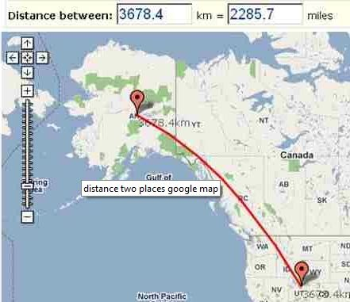
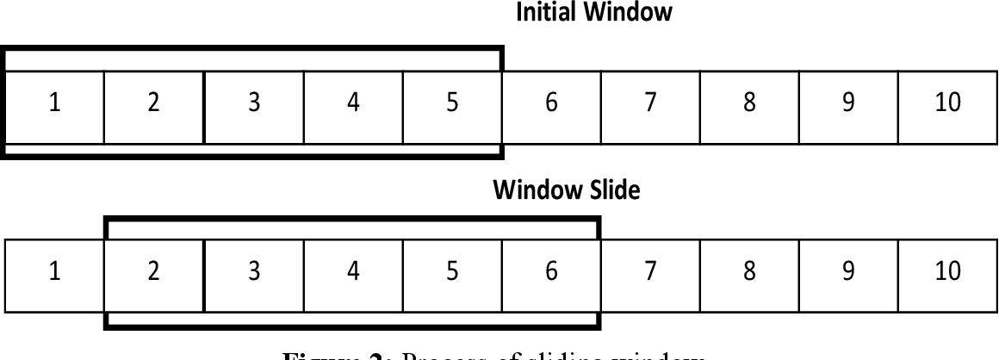

```{r setup, include=FALSE}
knitr::opts_chunk$set(echo = FALSE)
```

## Question 1: **Healthy Product Groups**:


* Which products can be labelled as **healthy**?
* Create 150-250 **Healthy** product groups concentrating on customer purchasing history

## Grouping based on 

* Customer purchasing history
* Existing Category Hierarchy
* NLP on product name/description

## Category Membership Ranking

How much does each product belong to a specific category (like *Health* for example?)

Are there some product groups we are confident they belong to a category?

- Yes: Supervised Learning (Label is required)

  * Binary Classification
  * Metric Regression (Metric Learning) 
  * Metric Classification 
    Large Margin nearest neighbors (`pylmnn` package)

- No:

  * Topic Modelling
  * Ranking based on similarities (Multi-dimensional scaling)

## Product Grouping  

Which Category does each product belong to?

### We don't know categories, tell us what categories can be?

  - Non-supervised learning
  
    * K-Means Clustering
    * Metric-based Clustering

### We know which categories we are looking for
  
  Multi-class Classification (labels are required)

## Combined iterative non-supaervised-supervised learning

  1- Run non-supervised grouping on similarities
  
  2- Update membership labels
  
  3- Run supervised learning
  
  4- Update feature weights
  
  5- Repeat from 1

## Suggessted Product Features:

  * *ProductPopularity*	(Cumulative Total Product Purchase Frequency)
      
  * *Product Purchase Frequency* (mean/median/max)
      
  * *Customer Product Purchase Rate* (what percentage of customers purchased this product recently)
      
  * *Average Amount per Purchase*
  
  * *Unit Price*
      
      
## Question 2: **Customer Needs**:

* What analysis would you perform to identify customer broader needs?

* What other customer need categories?
  Examples:
    - Party
    - Outdoor
    - Travel
    - Baby
    
## Suggested combined product similarities for metric clustering:

1- NLP-based metrics: Product Name/Product Description similarities
  
  * Hemming(Binary)
  * Cosine dissimilarity (Spherical), 
  * Minkovski, Canberra, ...

2- Co-purchase rate (Hemming metric for customer purchases)

3- Common Depth in the Existing Department/Hierarchy 


## Question 3: Customer Segments:

* Methodology
* Benefits
* Focus on customer product choice not RFV

## Suggested methodology Metric Clustering:

* purchase rate difference from each need group (frequency/quantity/amount)
(percentage of total purchase)

* Hemming metric (similarity of customers based on their common needs)
  
## Metric-based Clustering

- What is a metric?

- What is metric-based clustering

- How is it done?

## Metric (distance)

distance between two cities : A and B

Longitide and Latitude (x and y coordinates in a 2D space) -> Euclidean(Physical) distance



## Metric without Features

We know pair-wise distances but not coordinates (features)


{width=50%, height=50%}


## Hemming Metric

Hemming metric can represent similarity and distance between two entities based on their common inclusions

{width=50%, height=50%}

$$D_{Hemming} = 1.0 - n(A \cap B) / n(A \cup B) $$

## Metrics have a trend (time-series)

- Metric values are dynamic (time-dependant) 


## Dynamic metrics

- Periodic/Historic Aggregated Similarities: last _n_ days/weeks/months (Sliding/Cumulative Aggregated Windows)



## Multi-dimensional Scaling 

*N* cities, we know pairwise distances, find locations

*Input:* Symmetric square matrix of pair-wise distances

*Output:* Coordinates in n-dimensional space

## Benefits of Multi-dimensional Scaling :

- Run clustering algorithms like K-Means

- Helps visualizing them

- Create features from similarity metrics and use them in Supervised Learning techniques
  (Virtual Similarity Features)
  
      
      
      
      


